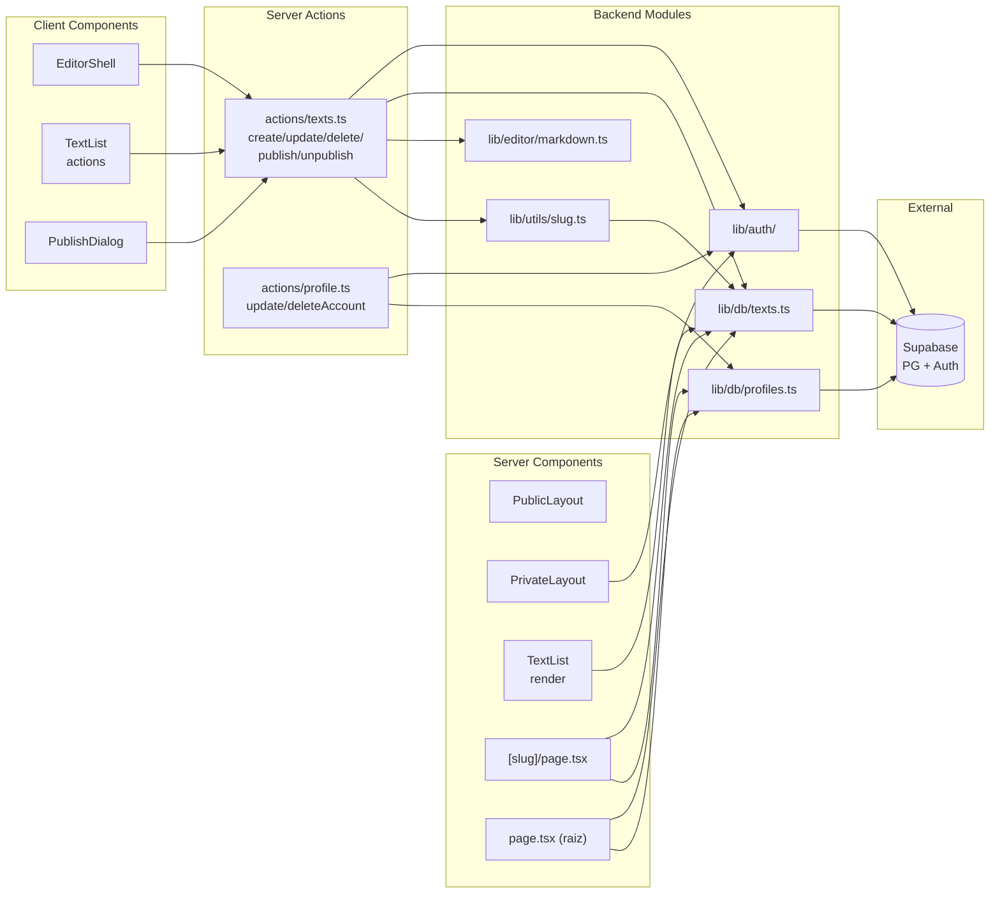
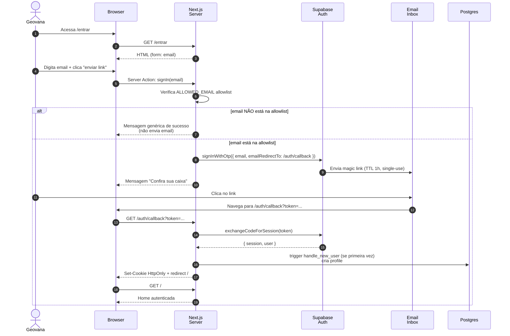
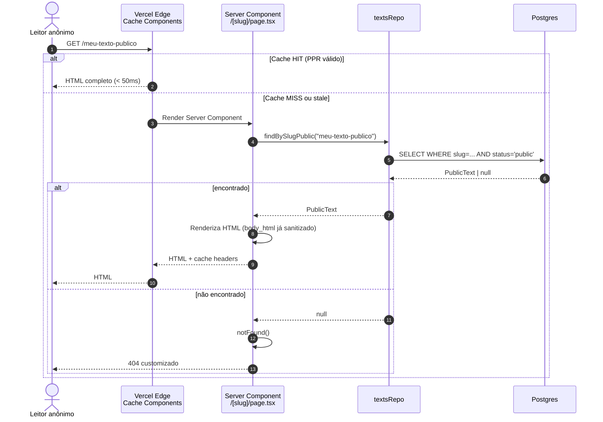
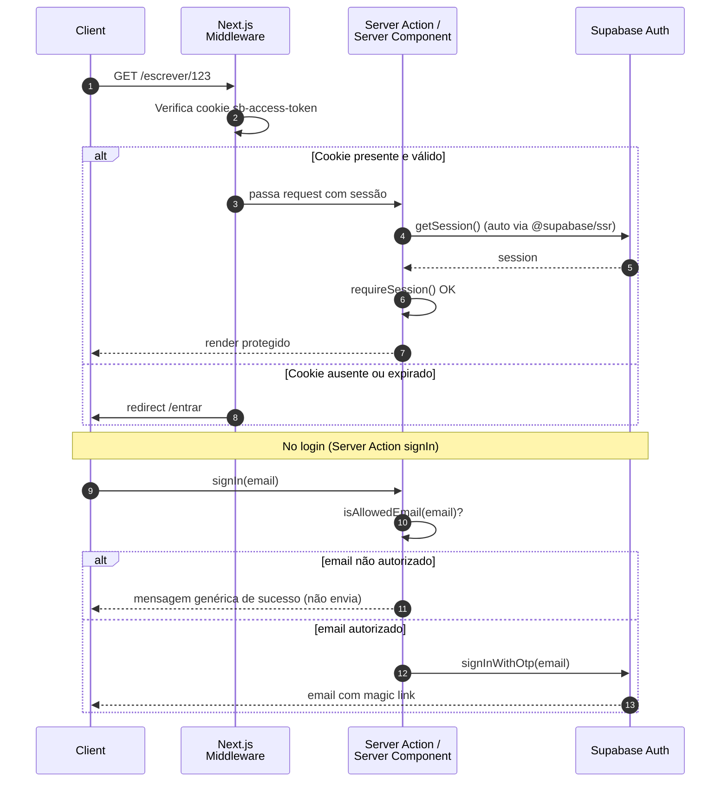
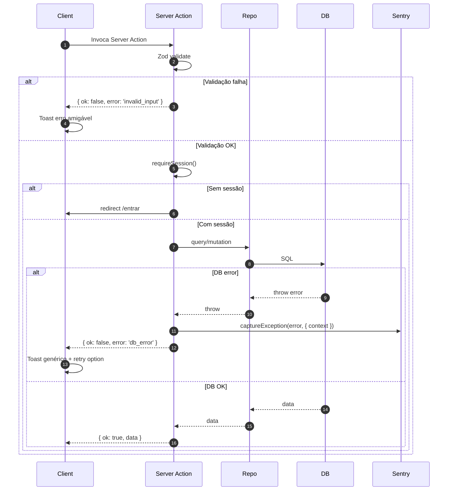

# Escritos da Geo — Fullstack Architecture Document

> **Documento:** Architecture v1.0
> **Autor:** Aria (`@architect`) a partir do PRD v1.0 e Project Brief v1.0
> **Data:** 2026-04-26
> **Status:** Rascunho — aguardando revisão por `@dev` (Lucas) antes de iniciar Story 1.1
> **Modo de geração:** YOLO completo a partir das constraints do PRD
> **Origem:** [Project Brief](./brief.md) · [PRD](./prd.md)

---

## 1. Introduction

Este documento define a arquitetura completa fullstack para **Escritos da Geo**, cobrindo backend, frontend, integração e infraestrutura. Serve como **fonte única de verdade** para desenvolvimento conduzido por AI agents (`@dev`), garantindo consistência através de toda a stack.

A abordagem unificada combina o que tradicionalmente seriam documentos separados de backend e frontend, refletindo a realidade de aplicações modernas Next.js onde essas camadas estão profundamente entrelaçadas (Server Components, Server Actions, Route Handlers).

### Starter Template or Existing Project

**N/A — Greenfield project.**

Não há starter template. Inicialização direta com `pnpm create next-app@latest` (Next.js 16 oficial), seguida de configuração manual de Tailwind 4, shadcn/ui, Supabase SSR, e fontes self-hosted. Razão: o produto é radicalmente minimalista; starters trazem dependências e abstrações desnecessárias para o escopo definido.

### Change Log

| Data | Versão | Descrição | Autor |
|------|--------|-----------|-------|
| 2026-04-26 | 1.0 | Versão inicial da Architecture Document a partir do PRD v1.0 (modo YOLO) | Aria (`@architect`) |

---

## 2. High Level Architecture

### Technical Summary

**Escritos da Geo** é uma aplicação **monolítica fullstack Next.js 16** deployada na **Vercel** com banco e autenticação via **Supabase**. A arquitetura é **server-first**: páginas públicas usam **Cache Components do Next 16** (PPR — Partial Prerendering) para SEO máximo e latência mínima; o editor privado é client component com Tiptap, comunicando via **Server Actions** type-safe para mutações e autosave. Autenticação é Magic Link sem senha (Supabase Auth), com **allowlist em camada de aplicação** restringindo acesso a Geovana no MVP. **RLS no PostgreSQL** garante isolamento de dados desde o dia 1, futurizando a transição para multi-tenant na Fase 2 sem refactor estrutural. Infraestrutura cabe em **free tier** (Vercel Hobby + Supabase Free), com custo previsto ≤ R$ 50/mês durante o MVP. Esta arquitetura realiza os goals do PRD (privacidade radical, performance ≥95 Lighthouse, custo magro, identidade visual coerente) com mínima superfície de manutenção para um desenvolvedor solo.

### Platform and Infrastructure Choice

**Platform:** **Vercel + Supabase**

**Key Services:**
- **Vercel:** Hosting Next.js (Hobby tier no MVP), Edge Network global, Vercel Analytics (privacy-first), Edge Rate Limiting, Open Graph image generation
- **Supabase:** PostgreSQL 15+, Supabase Auth (Magic Link), Backups automáticos diários, RLS engine
- **Resend:** Email transacional (Fase 2 — quando precisar customizar templates além dos magic links)
- **Sentry:** Observabilidade de erros server-side (free tier)
- **Registro.br:** Domínio `escritosdageo.com.br`

**Deployment Host and Regions:**
- **Vercel:** Edge Network global; primary serverless region `gru1` (São Paulo) para minimizar latência ao público brasileiro
- **Supabase:** Região `sa-east-1` (São Paulo, AWS) para co-localização com Vercel

### Repository Structure

**Structure:** **Monorepo simples (single Next.js project)**
**Monorepo Tool:** N/A — não usar Turborepo/Nx; pnpm workspaces opcional caso surja necessidade de pacote compartilhado
**Package Organization:** Single package `escritos-da-geo` com módulos internos em `lib/` (sem split em `apps/` + `packages/`)

**Razão:** o escopo MVP é coeso (um único app web). Overhead de monorepo multi-package não se justifica para 1 desenvolvedor solo trabalhando part-time. Migração para multi-package é trivial via `pnpm workspaces` se a Fase 2 demandar.

### High Level Architecture Diagram

```mermaid
graph TB
    subgraph "Usuárias"
        Geo[Geovana<br/>Editor Privado]
        Reader[Leitores Públicos<br/>Anônimos]
    end

    subgraph "Vercel Edge Network"
        CDN[Edge CDN<br/>Cache Components]
        Edge[Edge Middleware<br/>Auth + Rate Limit]
    end

    subgraph "Vercel Serverless gru1 — São Paulo"
        Public["Páginas Públicas<br/>Server Components<br/>(SSG/PPR)"]
        Editor["Editor & Lista<br/>Client + Server<br/>Components"]
        Actions["Server Actions<br/>autosave/publish/<br/>delete/export"]
        OG["OG Image Gen<br/>@vercel/og"]
        Health["/api/health<br/>Route Handler"]
    end

    subgraph "Supabase sa-east-1 — São Paulo"
        Auth["Supabase Auth<br/>Magic Link"]
        DB[("PostgreSQL 15<br/>texts + profiles<br/>+ RLS policies")]
        Backup[(Backup Diário<br/>7 dias retenção)]
    end

    subgraph "Observabilidade"
        Sentry[Sentry<br/>Errors Only]
        Vercel[Vercel Analytics<br/>Privacy-First]
    end

    Geo -->|HTTPS| CDN
    Reader -->|HTTPS| CDN
    CDN --> Edge
    Edge -->|"/" raiz<br/>"/[slug]"| Public
    Edge -->|"/escrever"<br/>"/textos" "/conta"| Editor
    Editor --> Actions
    Public --> OG
    Public --> DB
    Editor --> DB
    Actions --> DB
    Actions --> Auth
    Edge --> Auth
    Health --> DB
    DB -.->|nightly| Backup
    Actions --> Sentry
    Public --> Sentry
    Editor --> Vercel
    Public --> Vercel

    style Geo fill:#FAF7F2
    style Reader fill:#FAF7F2
    style DB fill:#1A1A1A,color:#FAF7F2
    style Auth fill:#1A1A1A,color:#FAF7F2
```

### Architectural Patterns

- **Monolithic Server-First Fullstack:** Single Next.js 16 application com App Router, Server Components por padrão e Client Components seletivos. _Rationale:_ minimiza complexidade operacional para dev solo; aproveita maturidade do Next.js para SSR/SSG/PPR sem necessidade de servidor backend separado.

- **Cache Components com Partial Prerendering (PPR):** Páginas públicas usam `'use cache'` directive do Next 16 com `cacheLife` apropriado; revalidação em `revalidatePath` ao publicar/despublicar. _Rationale:_ SEO máximo + latência sub-100ms para leitores anônimos sem complexidade de CDN externa.

- **Server Actions para Mutações Privadas:** Todas as ações de escrita (autosave, publicar, despublicar, excluir, exportar) implementadas via Server Actions ao invés de Route Handlers REST. _Rationale:_ type-safety end-to-end, validação Zod inline, redução de boilerplate, melhor DX para dev solo.

- **Repository Pattern em `lib/db/`:** Queries Supabase encapsuladas em funções por domínio (`textsRepo.create`, `textsRepo.list`, `textsRepo.publish`). _Rationale:_ desacopla UI de detalhes do Supabase; facilita teste de integração e migração futura se necessária.

- **Defense-in-Depth via RLS:** Row-Level Security ativada desde o dia 1 com policies "deny by default" + verificação de ownership na camada de aplicação. _Rationale:_ produto vende privacidade radical — falha de uma camada não deve causar exposição.

- **Allowlist Application-Layer (Single-Tenant Simulado):** RLS preparado para multi-tenant com `auth.uid() = user_id`, mas allowlist de email no `signInWithOtp` restringe acesso real a Geovana no MVP. _Rationale:_ futuriza Fase 2 sem refactor de schema; reduz risco de abertura acidental.

- **Frontend Component-Based com Compound Components:** UI organizada em componentes pequenos e composáveis usando shadcn/ui seletivo (Dialog, Toast, Tooltip) + componentes próprios para o editor. _Rationale:_ manutenibilidade e legibilidade em codebase pequeno.

- **Sanitização HTML Server-Side:** Markdown convertido para HTML server-side com `rehype-sanitize` antes de persistir e antes de renderizar. _Rationale:_ defesa contra XSS em produto que renderiza conteúdo gerado pela usuária.

- **Optimistic Autosave com Retry Exponencial:** Autosave debounced 800ms, retry com backoff (1s, 2s, 4s) por até 3 tentativas, flush no `beforeunload`. _Rationale:_ zero perda de dados (NFR20) sem latência percebida.

---

## 3. Tech Stack

> Esta tabela é a **fonte definitiva de verdade**. Toda story implementada deve usar exatamente estas versões.

### Technology Stack Table

| Category | Technology | Version | Purpose | Rationale |
|----------|-----------|---------|---------|-----------|
| Frontend Language | TypeScript | 5.6+ | Linguagem única em toda a stack | Type-safety end-to-end via Server Actions; alinhado a outros projetos do Lucas |
| Frontend Framework | Next.js | 16.x (App Router) | Framework fullstack | SSR/SSG/PPR nativos, Server Components, Cache Components, deploy Vercel-native |
| UI Component Library | shadcn/ui (seletivo) | Latest | Dialog, Toast, Tooltip apenas | Componentes copiáveis sem dependência runtime; full controle estético |
| State Management | React Server Components + `useState` local | N/A | Estado server-first | Sem Redux/Zustand — Server Components + Server Actions cobrem 95% do estado |
| Backend Language | TypeScript | 5.6+ | Linguagem única | Same as frontend (monorepo single-package) |
| Backend Framework | Next.js Server Actions + Route Handlers | 16.x | Mutações + APIs mínimas | Server Actions para mutações type-safe; Route Handlers só para webhooks e OG image |
| API Style | RPC via Server Actions + REST mínimo | N/A | Comunicação client↔server | Server Actions = RPC type-safe; REST só em `/api/health` e OG image |
| Database | PostgreSQL (Supabase) | 15+ | Banco relacional principal | Maduro, RLS nativo, free tier generoso, backups automáticos |
| Cache | Next.js Cache Components (PPR + `use cache`) | 16.x | Cache HTML público | Built-in no Next 16; sem Redis externo no MVP |
| File Storage | N/A no MVP | — | — | MVP é texto-only; sem imagens/mídia |
| Authentication | Supabase Auth (Magic Link OTP) | Latest | Autenticação sem senha | UX mínima, sem leak de senha, allowlist via `signInWithOtp` |
| Frontend Testing | Vitest + Testing Library | 2.x / 16.x | Component tests + util tests | Rápido, ESM-first, alinhado a Vite ecosystem |
| Backend Testing | Vitest + Supabase Local | 2.x | Server Actions + DB integration | Mesma ferramenta dos testes de frontend (DX coerente) |
| E2E Testing | Playwright | 1.x | Smoke E2E (Fase 1.5) | Padrão de mercado, melhor para Next.js do que Cypress |
| Build Tool | Next.js (Turbopack default em 16) | 16.x | Build production | Built-in, sem configuração extra |
| Bundler | Turbopack (Next.js 16 default) | Built-in | Bundling client + server | Padrão Next 16, sem opt-in necessário |
| IaC Tool | N/A no MVP | — | — | Vercel + Supabase configuradas via UI; quando crescer, considerar Pulumi |
| CI/CD | Vercel Git Integration + GitHub Actions | Latest | Deploy contínuo + checks | Vercel deploya em cada push; GH Actions para lint/test em PR |
| Monitoring | Vercel Analytics (Web Vitals + page views) | Built-in | RUM básico privacy-first | Sem cookies, sem cross-site tracking |
| Logging | Sentry (errors only) + Vercel Logs | Latest | Errors + structured logs | Sentry para exceptions, Vercel Logs para acessar runtime logs ad-hoc |
| Error Tracking | Sentry | Latest | Server-side exceptions | Free tier suficiente; configurar redaction agressiva |
| CSS Framework | Tailwind CSS | 4.x | Utility-first styling | Velocidade de desenvolvimento; tokens via CSS vars |
| Editor (Rich Text) | Tiptap | 2.x | Editor de escrita com markdown invisível | Maturidade, ecosystem markdown bidirecional, comunidade ativa |
| HTML Sanitization | rehype-sanitize | 6.x | Prevenção XSS no body_html | Server-side, padrão da comunidade unified/rehype |
| Markdown Pipeline | unified + remark + rehype | Latest | Markdown ↔ HTML | Padrão de mercado, modular, type-safe |
| Form Validation | Zod | 3.x | Validação de input em Server Actions | Type-safe, runtime + compile-time |
| Email Transacional | Supabase Auth nativo (MVP) → Resend (Fase 2) | Latest | Magic links | Supabase suficiente; Resend quando precisar customizar |
| Domain Registry | Registro.br | — | `.com.br` registration | Padrão para domínios brasileiros |

---

## 4. Data Models

### Text

**Purpose:** Representa um texto escrito por uma autora. Pode estar em estado privado (default) ou público (após ação consciente). Núcleo do produto.

**Key Attributes:**
- `id`: uuid — Identificador único
- `user_id`: uuid (FK auth.users) — Dona do texto
- `title`: string — Título (pode ser vazio)
- `body_markdown`: string — Conteúdo em markdown puro (fonte da verdade)
- `body_html`: string — Conteúdo HTML sanitizado (renderização)
- `slug`: string | null — Slug URL-friendly (apenas quando publicado; mantido após despublicar para evitar reciclagem)
- `status`: 'private' | 'public' — Estado de visibilidade
- `published_at`: Date | null — Timestamp de primeira publicação
- `created_at`: Date — Criação
- `updated_at`: Date — Última modificação (autosave)

#### TypeScript Interface

```typescript
export type TextStatus = 'private' | 'public';

export interface Text {
  id: string;
  user_id: string;
  title: string;
  body_markdown: string;
  body_html: string;
  slug: string | null;
  status: TextStatus;
  published_at: string | null; // ISO 8601
  created_at: string;          // ISO 8601
  updated_at: string;          // ISO 8601
}

export interface TextListItem {
  id: string;
  title: string;
  first_sentence: string; // Derivada client-side ou em view SQL
  status: TextStatus;
  created_at: string;
}

export interface PublicText {
  slug: string;
  title: string;
  body_html: string;
  published_at: string;
  display_name: string; // Da tabela profiles
}
```

#### Relationships

- `text.user_id` → `profiles.id` (1:N) — uma autora tem múltiplos textos
- `text.user_id` → `auth.users.id` (1:N) — uma usuária autenticada tem múltiplos textos

---

### Profile

**Purpose:** Identidade pública da autora. Separada de `auth.users` para permitir leitura pública sem expor o auth schema.

**Key Attributes:**
- `id`: uuid (PK + FK auth.users) — Mesmo ID do usuário autenticado
- `display_name`: string — Nome visível nas páginas públicas (default: "Geovana")
- `bio`: string | null — Uma frase curta exibida no índice público
- `created_at`: Date
- `updated_at`: Date

#### TypeScript Interface

```typescript
export interface Profile {
  id: string;
  display_name: string;
  bio: string | null;
  created_at: string;
  updated_at: string;
}
```

#### Relationships

- `profile.id` ↔ `auth.users.id` (1:1, criado via trigger `handle_new_user`)
- `profile.id` ↔ `texts.user_id` (1:N)

---

## 5. API Specification

### Server Actions (RPC type-safe — primária)

> Server Actions são a **API primária** do produto. Nenhum fetch manual no client; todas as mutações via importação direta de funções `'use server'`.

```typescript
// lib/actions/texts.ts
'use server';

export async function createText(): Promise<{ ok: true; id: string } | { ok: false; error: string }>;

export async function updateText(input: {
  id: string;
  title?: string;
  body_markdown: string;
}): Promise<{ ok: true } | { ok: false; error: string }>;

export async function deleteText(id: string): Promise<{ ok: true } | { ok: false; error: string }>;

export async function publishText(input: {
  id: string;
  custom_slug?: string;
}): Promise<{ ok: true; slug: string; url: string } | { ok: false; error: string }>;

export async function unpublishText(id: string): Promise<{ ok: true } | { ok: false; error: string }>;

export async function exportAllTextsAsMarkdown(): Promise<Blob>;

// lib/actions/profile.ts
'use server';

export async function updateProfile(input: {
  display_name?: string;
  bio?: string;
}): Promise<{ ok: true } | { ok: false; error: string }>;

export async function deleteAccount(confirmation: 'EXCLUIR MINHA CONTA'): Promise<{ ok: true } | { ok: false; error: string }>;
```

### REST API Specification (mínima — apenas para casos onde Server Actions não cabem)

```yaml
openapi: 3.0.0
info:
  title: Escritos da Geo — Public REST API
  version: 1.0.0
  description: |
    APIs REST mínimas. A maioria das operações usa Server Actions.
    Estes endpoints existem para:
      - Health check (monitoramento externo)
      - OG image dinâmica (consumida por crawlers de redes sociais)

servers:
  - url: https://escritosdageo.com.br
    description: Production

paths:
  /api/health:
    get:
      summary: Health check
      description: Verifica conectividade com Supabase + auth + DB
      responses:
        '200':
          description: Sistema saudável
          content:
            application/json:
              schema:
                type: object
                properties:
                  ok: { type: boolean, example: true }
                  timestamp: { type: string, format: date-time }
                  checks:
                    type: object
                    properties:
                      database: { type: string, enum: [ok, fail] }
                      auth: { type: string, enum: [ok, fail] }
        '503':
          description: Sistema com falha
          content:
            application/json:
              schema:
                type: object
                properties:
                  ok: { type: boolean, example: false }
                  error: { type: string }

  /{slug}/opengraph-image:
    get:
      summary: Gera Open Graph image dinâmica para o texto público
      description: Implementado via app/(publico)/[slug]/opengraph-image.tsx (@vercel/og)
      parameters:
        - name: slug
          in: path
          required: true
          schema: { type: string }
      responses:
        '200':
          description: Imagem PNG 1200x630
          content:
            image/png: {}
        '404':
          description: Slug não encontrado ou texto não-público
```

---

## 6. Components

### Frontend — Logical Components

#### EditorShell (`components/editor/EditorShell.tsx`)
**Responsibility:** Wrapper do editor Tiptap incluindo modo zen, indicador de autosave, botão de publicar.
**Key Interfaces:**
- Props: `{ initialText: Text }`
- Emits: nada (usa Server Actions internamente)
**Dependencies:** Tiptap core + extensões, `lib/actions/texts`, `components/ui/Dialog`
**Technology Stack:** Client Component, Tiptap 2.x, Tailwind, Lucide icons

#### TextList (`components/texts/TextList.tsx`)
**Responsibility:** Lista cronológica reversa de textos com ações de excluir.
**Key Interfaces:**
- Props: `{ items: TextListItem[] }`
- Emits: callbacks para `revalidatePath` via Server Actions
**Dependencies:** `lib/actions/texts.deleteText`, `components/ui/AlertDialog`
**Technology Stack:** Server Component (renderização) + Client Component (interatividade do excluir)

#### PublicLayout (`app/(publico)/layout.tsx`)
**Responsibility:** Layout das páginas públicas — sem sidebar, sem auth, com SEO meta tags.
**Key Interfaces:** `{ children: ReactNode }`
**Dependencies:** Tipografia primária, Tailwind tokens
**Technology Stack:** Server Component, Cache Components (`use cache`)

#### PrivateLayout (`app/(privado)/layout.tsx`)
**Responsibility:** Layout autenticado — header minimalista, gate de auth, link para `/conta`.
**Key Interfaces:** `{ children: ReactNode }`
**Dependencies:** `lib/auth/getSession`, `redirect` do Next.js
**Technology Stack:** Server Component, sem cache (sempre fresco)

#### PublishDialog (`components/editor/PublishDialog.tsx`)
**Responsibility:** Dialog modal de publicação com fricção consciente (URL preview, slug editável, confirmação).
**Key Interfaces:** Props: `{ textId, currentTitle, currentSlug }`
**Dependencies:** `lib/actions/texts.publishText`, shadcn/ui Dialog
**Technology Stack:** Client Component

### Backend — Logical Components

#### Auth Layer (`lib/auth/`)
**Responsibility:** Gerenciar sessão Supabase Auth, allowlist, redirecionamento.
**Key Interfaces:**
- `getSession()` → `Session | null`
- `requireSession()` → `Session` (throws se ausente)
- `isAllowedEmail(email)` → boolean
**Dependencies:** `@supabase/ssr`, env var `ALLOWED_EMAIL`
**Technology Stack:** TypeScript puro, executa em Server Components/Actions/Middleware

#### Texts Repository (`lib/db/texts.ts`)
**Responsibility:** Encapsula todas as queries Supabase para a tabela `texts`.
**Key Interfaces:**
- `textsRepo.create(userId)` → `Text`
- `textsRepo.update(id, fields, userId)` → `void`
- `textsRepo.list(userId)` → `TextListItem[]`
- `textsRepo.findBySlugPublic(slug)` → `PublicText | null`
- `textsRepo.delete(id, userId)` → `void`
- `textsRepo.publish(id, slug, userId)` → `void`
- `textsRepo.unpublish(id, userId)` → `void`
- `textsRepo.listAllForExport(userId)` → `Text[]`
**Dependencies:** `lib/supabase/server`, types gerados
**Technology Stack:** TypeScript puro, server-only

#### Profiles Repository (`lib/db/profiles.ts`)
**Responsibility:** CRUD do profile da usuária autenticada.
**Key Interfaces:**
- `profilesRepo.get(userId)` → `Profile`
- `profilesRepo.update(userId, fields)` → `void`
- `profilesRepo.delete(userId)` → `void` (cascade textos)
**Dependencies:** `lib/supabase/server` + admin client para delete
**Technology Stack:** TypeScript puro, server-only

#### Markdown Pipeline (`lib/editor/markdown.ts`)
**Responsibility:** Conversão markdown ↔ HTML com sanitização.
**Key Interfaces:**
- `markdownToSafeHtml(markdown)` → `string`
- `markdownToFirstSentence(markdown, maxLength)` → `string`
- `htmlToMarkdown(html)` → `string` (Tiptap → storage)
**Dependencies:** `unified`, `remark-parse`, `remark-rehype`, `rehype-sanitize`, `rehype-stringify`
**Technology Stack:** TypeScript puro, executa em Server Actions

#### Slug Generator (`lib/utils/slug.ts`)
**Responsibility:** Gera slugs URL-friendly únicos a partir de títulos.
**Key Interfaces:**
- `generateSlug(title)` → `string`
- `ensureUniqueSlug(baseSlug, excludeId?)` → `Promise<string>`
**Dependencies:** `lib/db/texts` (para checagem de unicidade)
**Technology Stack:** TypeScript puro

#### Component Diagram



---

## 7. External APIs

**Nenhuma integração externa no MVP.**

Justificativa:
- Sem analytics de terceiros (Google Analytics, Mixpanel) — coerência com posicionamento de privacidade
- Sem CMS — todo conteúdo nasce no próprio editor
- Sem CDN externo — Vercel Edge Network é suficiente
- Sem serviço de busca — busca textual é Fase 1.5
- Sem pagamentos — modelo de negócio fora do escopo MVP

**Fase 2 (planejado):**
- **Resend** para email transacional além de magic links (newsletter editorial, notificações pontuais)
- **Plausible Analytics** opcional para complementar Vercel Analytics

---

## 8. Core Workflows

### Workflow A — Login com Magic Link (Geovana)



### Workflow B — Escrita com Autosave + Publicação Consciente

```mermaid
sequenceDiagram
    autonumber
    actor Geo as Geovana
    participant Editor as EditorShell<br/>(Client)
    participant Action as Server Action
    participant Markdown as markdown<br/>pipeline
    participant Repo as textsRepo
    participant DB as Postgres
    participant Cache as Next Cache

    Geo->>Editor: Click "escrever"
    Editor->>Action: createText()
    Action->>Repo: create(userId)
    Repo->>DB: INSERT texts (vazio, status=private)
    DB-->>Repo: { id }
    Action-->>Editor: { ok: true, id }
    Editor->>Editor: router.push(/escrever/[id])

    loop A cada keystroke
        Geo->>Editor: Digita conteúdo
        Editor->>Editor: debounce 800ms
        Editor->>Action: updateText({ id, title, body_markdown })
        Action->>Markdown: markdownToSafeHtml(body)
        Markdown-->>Action: body_html sanitizado
        Action->>Repo: update(id, fields, userId)
        Repo->>DB: UPDATE texts (RLS verifica ownership)
        DB-->>Repo: ok
        Action-->>Editor: { ok: true }
        Editor->>Editor: Atualiza indicador discreto
    end

    Note over Geo,Cache: Quando Geovana decide publicar...

    Geo->>Editor: Click "publicar"
    Editor->>Editor: Abre PublishDialog (mostra URL preview)
    Geo->>Editor: Confirma
    Editor->>Action: publishText({ id, customSlug? })
    Action->>Repo: ensureUniqueSlug(slug)
    Action->>Repo: publish(id, slug, userId)
    Repo->>DB: UPDATE status=public, slug, published_at
    Action->>Cache: revalidatePath('/'); revalidatePath('/[slug]')
    Action-->>Editor: { ok: true, slug, url }
    Editor->>Geo: Toast "Está publicado em escritosdageo.com.br/[slug]"
```

### Workflow C — Leitura Pública (visitante anônimo)



---

## 9. Database Schema

```sql
-- Migration 0001_initial_setup.sql
create extension if not exists pgcrypto;

-- ============================================================================
-- Migration 0002_create_profiles_table.sql
-- ============================================================================
create table public.profiles (
  id uuid primary key references auth.users(id) on delete cascade,
  display_name text not null default 'Geovana',
  bio text,
  created_at timestamptz not null default now(),
  updated_at timestamptz not null default now()
);

-- Trigger: criar profile automaticamente ao criar usuário
create or replace function public.handle_new_user()
returns trigger
language plpgsql
security definer
set search_path = public
as $$
begin
  insert into public.profiles (id, display_name)
  values (new.id, coalesce(new.raw_user_meta_data->>'display_name', 'Geovana'));
  return new;
end;
$$;

create trigger on_auth_user_created
  after insert on auth.users
  for each row execute procedure public.handle_new_user();

-- Trigger: atualizar updated_at automaticamente
create or replace function public.set_updated_at()
returns trigger
language plpgsql
as $$
begin
  new.updated_at = now();
  return new;
end;
$$;

create trigger profiles_set_updated_at
  before update on public.profiles
  for each row execute procedure public.set_updated_at();

-- RLS profiles: leitura pública (para páginas públicas), escrita apenas pela própria
alter table public.profiles enable row level security;

create policy "profiles_select_public"
  on public.profiles for select
  using (true);

create policy "profiles_update_own"
  on public.profiles for update
  using (auth.uid() = id)
  with check (auth.uid() = id);

create policy "profiles_delete_own"
  on public.profiles for delete
  using (auth.uid() = id);

-- ============================================================================
-- Migration 0003_create_texts_table.sql
-- ============================================================================
create type public.text_status as enum ('private', 'public');

create table public.texts (
  id uuid primary key default gen_random_uuid(),
  user_id uuid not null references auth.users(id) on delete cascade,
  title text not null default '',
  body_markdown text not null default '',
  body_html text not null default '',
  slug text,
  status public.text_status not null default 'private',
  published_at timestamptz,
  created_at timestamptz not null default now(),
  updated_at timestamptz not null default now()
);

-- Índices
create index texts_user_id_idx on public.texts(user_id);
create index texts_user_id_created_at_idx on public.texts(user_id, created_at desc);
create unique index texts_slug_public_unique
  on public.texts(slug)
  where status = 'public' and slug is not null;

-- Trigger updated_at
create trigger texts_set_updated_at
  before update on public.texts
  for each row execute procedure public.set_updated_at();

-- RLS texts
alter table public.texts enable row level security;

-- Leitura: própria autora vê tudo + textos público lidos por qualquer um
create policy "texts_select_own_or_public"
  on public.texts for select
  using (
    (auth.uid() = user_id)
    or (status = 'public')
  );

-- Insert: apenas com próprio user_id
create policy "texts_insert_own"
  on public.texts for insert
  with check (auth.uid() = user_id);

-- Update: apenas próprios textos
create policy "texts_update_own"
  on public.texts for update
  using (auth.uid() = user_id)
  with check (auth.uid() = user_id);

-- Delete: apenas próprios textos
create policy "texts_delete_own"
  on public.texts for delete
  using (auth.uid() = user_id);
```

**Decisões de schema:**
- `body_markdown` = fonte da verdade; `body_html` = cache renderizado server-side (evita re-render em cada request)
- `slug` permanece após despublicar (`status` muda mas `slug` mantido) para evitar reciclagem acidental se republicar
- Unique parcial em `(slug WHERE status='public')` permite múltiplos textos com `slug=null` (privados não precisam de slug único)
- `on delete cascade` em `auth.users → profiles → texts` garante exclusão completa de conta sem órfãos

---

## 10. Frontend Architecture

### Component Architecture

#### Component Organization

```text
components/
├── ui/                           # shadcn/ui (copiados, customizados)
│   ├── Dialog.tsx
│   ├── AlertDialog.tsx
│   ├── Toast.tsx
│   ├── Tooltip.tsx
│   └── Button.tsx
├── editor/
│   ├── EditorShell.tsx           # Client Component principal do editor
│   ├── EditorContent.tsx         # Tiptap content
│   ├── ZenMode.tsx               # Hook + lógica de auto-fade
│   ├── AutosaveIndicator.tsx     # Reticência discreta
│   └── PublishDialog.tsx         # Confirmação de publicação
├── texts/
│   ├── TextList.tsx              # Server Component (renderização)
│   ├── TextListItem.tsx          # Client Component (ações hover)
│   └── EmptyState.tsx
├── layout/
│   ├── PrivateHeader.tsx         # Header de área autenticada
│   └── PublicHeader.tsx          # Header de páginas públicas
└── auth/
    └── SignInForm.tsx            # Form de magic link
```

#### Component Template

```typescript
// Padrão para Client Components
'use client';

import { useState, useTransition } from 'react';
import { someAction } from '@/lib/actions/texts';

interface Props {
  initialValue: string;
  textId: string;
}

export function MyComponent({ initialValue, textId }: Props) {
  const [value, setValue] = useState(initialValue);
  const [isPending, startTransition] = useTransition();

  const handleSave = () => {
    startTransition(async () => {
      const result = await someAction({ id: textId, value });
      if (!result.ok) {
        // Toast de erro
      }
    });
  };

  return (
    <div className="font-serif text-[18px] leading-relaxed">
      {/* JSX */}
    </div>
  );
}
```

### State Management Architecture

#### State Structure

```typescript
// 95% do estado vive no servidor (Server Components + Server Actions)
// Estado local de cliente é mínimo e isolado por componente

// Editor: useState local + useTransition para mutações
// Modo Zen: useState + useEffect (event listeners)
// Forms: useFormState (React 19) ou useState + Server Action direta
// Dialogs: useState para open/closed

// SEM Redux, SEM Zustand, SEM Jotai
// SEM Context global (exceto tema futuro)
```

#### State Management Patterns

- Server Components leem dados; Client Components recebem como props
- Mutações sempre via Server Actions (`'use server'`); revalidação via `revalidatePath` ou `revalidateTag`
- Estado local de UI (hover, dialog open, debounce) em `useState` no componente
- `useTransition` para loading states de Server Actions sem bloquear UI
- Forms críticos usam `useActionState` (React 19) para feedback de validação

### Routing Architecture

#### Route Organization

```text
app/
├── layout.tsx                    # Root layout (fonte, paleta, meta)
├── page.tsx                      # Decide: redireciona para (publico) ou (privado)
├── not-found.tsx                 # 404 customizado em tom íntimo-sóbrio
├── (privado)/                    # Route group autenticado
│   ├── layout.tsx                # Auth gate + header autenticado
│   ├── page.tsx                  # Home autenticada (lista recente)
│   ├── escrever/
│   │   ├── page.tsx              # Cria novo + redireciona para /escrever/[id]
│   │   └── [id]/
│   │       └── page.tsx          # Editor
│   ├── textos/
│   │   └── page.tsx              # Lista cronológica completa
│   └── conta/
│       ├── page.tsx              # Configurações
│       └── excluir/
│           └── page.tsx          # Confirmação dupla de exclusão
├── (publico)/                    # Route group público (sem auth)
│   ├── layout.tsx                # Layout limpo + cache
│   ├── page.tsx                  # Índice raiz: escritosdageo.com.br
│   └── [slug]/
│       ├── page.tsx              # Texto público individual
│       └── opengraph-image.tsx   # OG image dinâmica
├── auth/
│   ├── callback/
│   │   └── route.ts              # Magic link callback (Route Handler)
│   └── signout/
│       └── route.ts              # Logout (Route Handler)
├── entrar/
│   └── page.tsx                  # Página de login (não-autenticada)
├── privacidade/
│   └── page.tsx                  # Política de Privacidade (LGPD)
├── termos/
│   └── page.tsx                  # Termos de Uso
├── api/
│   └── health/
│       └── route.ts              # Health check
├── sitemap.ts                    # Sitemap dinâmico
└── robots.ts                     # robots.txt
```

#### Protected Route Pattern

```typescript
// app/(privado)/layout.tsx
import { redirect } from 'next/navigation';
import { getSession } from '@/lib/auth/getSession';
import { PrivateHeader } from '@/components/layout/PrivateHeader';

export default async function PrivateLayout({
  children,
}: {
  children: React.ReactNode;
}) {
  const session = await getSession();
  if (!session) redirect('/entrar');

  return (
    <div className="min-h-screen bg-paper">
      <PrivateHeader />
      <main className="mx-auto max-w-[680px] px-6 py-12">
        {children}
      </main>
    </div>
  );
}
```

### Frontend Services Layer

#### API Client Setup

```typescript
// Não há "API client" tradicional — Server Actions são importadas diretamente.
// Para Client Components que precisam de dados que NÃO vêm como props:

// lib/services/texts-client.ts
'use client';

import { createBrowserClient } from '@supabase/ssr';

export function getSupabaseBrowser() {
  return createBrowserClient(
    process.env.NEXT_PUBLIC_SUPABASE_URL!,
    process.env.NEXT_PUBLIC_SUPABASE_ANON_KEY!
  );
}

// Uso raro — preferir Server Components passando dados via props
```

#### Service Example

```typescript
// Padrão: Client Component invoca Server Action diretamente

// components/editor/EditorShell.tsx
'use client';

import { useTransition } from 'react';
import { updateText } from '@/lib/actions/texts';
import { useDebouncedCallback } from '@/lib/hooks/useDebouncedCallback';

export function EditorShell({ initialText }: { initialText: Text }) {
  const [isPending, startTransition] = useTransition();

  const debouncedSave = useDebouncedCallback(
    (title: string, body_markdown: string) => {
      startTransition(async () => {
        const result = await updateText({ id: initialText.id, title, body_markdown });
        if (!result.ok) {
          // Retry exponencial implementado no hook
        }
      });
    },
    800
  );

  return <EditorContent onChange={debouncedSave} initial={initialText} />;
}
```

---

## 11. Backend Architecture

### Service Architecture

**Tipo:** **Serverless via Next.js no Vercel** (sem servidor tradicional, sem long-running processes).

#### Function Organization

```text
app/
├── api/                          # Route Handlers (REST mínimo)
│   └── health/
│       └── route.ts
└── auth/                         # Route Handlers para fluxos OAuth/OTP
    ├── callback/
    │   └── route.ts
    └── signout/
        └── route.ts

lib/
├── actions/                      # Server Actions (RPC primário)
│   ├── texts.ts                  # CRUD + publish/unpublish/export
│   └── profile.ts                # Update + deleteAccount
├── db/                           # Repository layer
│   ├── texts.ts
│   └── profiles.ts
├── auth/                         # Sessão + allowlist
│   ├── getSession.ts
│   ├── requireSession.ts
│   └── allowlist.ts
├── editor/                       # Markdown pipeline
│   └── markdown.ts
├── utils/                        # Pure functions
│   └── slug.ts
└── supabase/
    ├── server.ts                 # Cliente Server Components/Actions
    ├── browser.ts                # Cliente browser
    ├── admin.ts                  # Service role (apenas server)
    └── database.types.ts         # Types gerados
```

#### Function Template

```typescript
// lib/actions/texts.ts — Padrão de Server Action
'use server';

import { z } from 'zod';
import { revalidatePath } from 'next/cache';
import { requireSession } from '@/lib/auth/requireSession';
import { textsRepo } from '@/lib/db/texts';
import { markdownToSafeHtml } from '@/lib/editor/markdown';
import { generateSlug, ensureUniqueSlug } from '@/lib/utils/slug';

const updateSchema = z.object({
  id: z.string().uuid(),
  title: z.string().max(200).optional(),
  body_markdown: z.string().max(100_000),
});

export async function updateText(
  input: z.input<typeof updateSchema>
): Promise<{ ok: true } | { ok: false; error: string }> {
  try {
    const session = await requireSession();
    const { id, title, body_markdown } = updateSchema.parse(input);

    const body_html = await markdownToSafeHtml(body_markdown);

    await textsRepo.update(id, { title, body_markdown, body_html }, session.user.id);

    return { ok: true };
  } catch (error) {
    return { ok: false, error: error instanceof Error ? error.message : 'unknown' };
  }
}
```

### Database Architecture

#### Schema Design

(Ver Seção 9 acima — schema completo em SQL DDL.)

#### Data Access Layer

```typescript
// lib/db/texts.ts — Repository pattern
import { createServerClient } from '@/lib/supabase/server';
import type { Text, TextListItem, PublicText } from '@/lib/types';

export const textsRepo = {
  async create(userId: string): Promise<{ id: string }> {
    const supabase = await createServerClient();
    const { data, error } = await supabase
      .from('texts')
      .insert({ user_id: userId })
      .select('id')
      .single();
    if (error) throw error;
    return data;
  },

  async update(
    id: string,
    fields: Partial<Pick<Text, 'title' | 'body_markdown' | 'body_html'>>,
    userId: string
  ): Promise<void> {
    const supabase = await createServerClient();
    const { error } = await supabase
      .from('texts')
      .update(fields)
      .eq('id', id)
      .eq('user_id', userId); // Defense-in-depth (RLS já bloqueia, mas explícito é seguro)
    if (error) throw error;
  },

  async list(userId: string): Promise<TextListItem[]> {
    const supabase = await createServerClient();
    const { data, error } = await supabase
      .from('texts')
      .select('id, title, body_markdown, status, created_at')
      .eq('user_id', userId)
      .order('created_at', { ascending: false });
    if (error) throw error;
    return data.map(toListItem);
  },

  async findBySlugPublic(slug: string): Promise<PublicText | null> {
    const supabase = await createServerClient();
    const { data, error } = await supabase
      .from('texts')
      .select('slug, title, body_html, published_at, profiles(display_name)')
      .eq('slug', slug)
      .eq('status', 'public')
      .single();
    if (error) return null;
    return toPublicText(data);
  },

  // ... outras operações: delete, publish, unpublish, listAllForExport
};
```

### Authentication and Authorization

#### Auth Flow



#### Middleware/Guards

```typescript
// middleware.ts — Refresh de sessão Supabase
import { createServerClient } from '@supabase/ssr';
import { NextResponse, type NextRequest } from 'next/server';

export async function middleware(request: NextRequest) {
  const response = NextResponse.next();

  const supabase = createServerClient(
    process.env.NEXT_PUBLIC_SUPABASE_URL!,
    process.env.NEXT_PUBLIC_SUPABASE_ANON_KEY!,
    {
      cookies: {
        getAll: () => request.cookies.getAll(),
        setAll: (cookies) => {
          cookies.forEach(({ name, value, options }) =>
            response.cookies.set(name, value, options)
          );
        },
      },
    }
  );

  await supabase.auth.getUser(); // refresh silencioso

  return response;
}

export const config = {
  matcher: ['/((?!_next/static|_next/image|favicon.ico|opengraph-image).*)'],
};
```

```typescript
// lib/auth/requireSession.ts
import { redirect } from 'next/navigation';
import { getSession } from './getSession';

export async function requireSession() {
  const session = await getSession();
  if (!session) redirect('/entrar');
  return session;
}
```

```typescript
// lib/auth/allowlist.ts
const ALLOWED = (process.env.ALLOWED_EMAIL ?? '').toLowerCase();

export function isAllowedEmail(email: string): boolean {
  return email.trim().toLowerCase() === ALLOWED;
}
```

---

## 12. Unified Project Structure

```text
escritos-da-geo/
├── .github/
│   └── workflows/
│       └── ci.yaml                    # Lint + typecheck + test em PR
├── app/                                # Next.js App Router
│   ├── (privado)/                      # Route group autenticado
│   │   ├── layout.tsx
│   │   ├── page.tsx                    # Home autenticada
│   │   ├── escrever/
│   │   │   ├── page.tsx                # Cria texto + redirect
│   │   │   └── [id]/page.tsx           # Editor
│   │   ├── textos/page.tsx             # Lista cronológica
│   │   └── conta/
│   │       ├── page.tsx                # Configurações
│   │       └── excluir/page.tsx
│   ├── (publico)/                      # Route group público
│   │   ├── layout.tsx
│   │   ├── page.tsx                    # Índice raiz
│   │   └── [slug]/
│   │       ├── page.tsx                # Texto público
│   │       └── opengraph-image.tsx
│   ├── auth/
│   │   ├── callback/route.ts
│   │   └── signout/route.ts
│   ├── api/health/route.ts
│   ├── entrar/page.tsx
│   ├── privacidade/page.tsx
│   ├── termos/page.tsx
│   ├── layout.tsx                      # Root layout (fonte, paleta)
│   ├── page.tsx                        # Decide redirect público/privado
│   ├── not-found.tsx                   # 404 elegante
│   ├── sitemap.ts
│   ├── robots.ts
│   └── globals.css                     # Tailwind + tokens
├── components/
│   ├── ui/                             # shadcn/ui copiados
│   ├── editor/
│   ├── texts/
│   ├── layout/
│   └── auth/
├── lib/
│   ├── actions/                        # Server Actions
│   ├── db/                             # Repository layer
│   ├── auth/                           # Sessão + allowlist
│   ├── editor/                         # Markdown pipeline
│   ├── hooks/                          # useDebouncedCallback, etc.
│   ├── utils/                          # slug, date formatting, etc.
│   ├── supabase/                       # Clientes
│   └── types.ts                        # Reexports ergonômicos
├── styles/
│   └── tokens.css                      # CSS custom properties
├── public/
│   ├── favicon.ico
│   └── og-default.png                  # OG fallback
├── supabase/
│   ├── migrations/
│   │   ├── 0001_initial_setup.sql
│   │   ├── 0002_create_profiles_table.sql
│   │   └── 0003_create_texts_table.sql
│   └── config.toml                     # Supabase CLI config
├── tests/
│   ├── unit/
│   │   └── slug.test.ts
│   └── integration/
│       └── texts-actions.test.ts
├── docs/
│   ├── brief.md
│   ├── prd.md
│   ├── architecture.md                 # Este documento
│   └── smoke-test.md
├── scripts/
│   └── backup-local.ts                 # npm run backup:local
├── .env.local.example
├── .eslintrc.json
├── .gitignore
├── .prettierrc
├── lefthook.yml                        # Pre-commit hooks
├── middleware.ts
├── next.config.mjs
├── package.json
├── pnpm-lock.yaml
├── README.md
├── CLAUDE.md                           # Instruções para AI agents
├── tailwind.config.ts
├── tsconfig.json
└── vitest.config.ts
```

---

## 13. Development Workflow

### Local Development Setup

#### Prerequisites

```bash
# Versões mínimas
node --version    # >= 20.x (recomendado 22.x)
pnpm --version    # >= 9.x
git --version     # >= 2.40
brew install supabase/tap/supabase  # Supabase CLI (macOS)
```

#### Initial Setup

```bash
# Clone (após Story 1.1)
git clone git@github.com:lucasrodrigues/escritos-da-geo.git
cd escritos-da-geo

# Dependências
pnpm install

# Supabase local
supabase start                          # sobe Postgres + auth + studio
supabase db reset                       # aplica migrations

# Variáveis de ambiente
cp .env.local.example .env.local
# Editar .env.local com valores reais (ALLOWED_EMAIL, SUPABASE_*, SENTRY_DSN)

# Gerar types do Supabase
pnpm db:types
```

#### Development Commands

```bash
# Iniciar dev server
pnpm dev                                # Next.js + Turbopack na porta 3000

# Banco
pnpm db:migrate                         # Aplica novas migrations
pnpm db:reset                           # Reset completo (dev only)
pnpm db:types                           # Regenera lib/supabase/database.types.ts

# Testes
pnpm test                               # Vitest watch
pnpm test:unit                          # Unit only
pnpm test:integration                   # Integration (requer supabase start)

# Quality checks
pnpm lint                               # ESLint
pnpm typecheck                          # tsc --noEmit
pnpm format                             # Prettier write

# Build production
pnpm build                              # next build
pnpm start                              # next start (preview production local)

# Backup local (Lucas executa semanal)
pnpm backup:local                       # baixa export markdown completo
```

### Environment Configuration

#### Required Environment Variables

```bash
# Frontend & Server (.env.local)
NEXT_PUBLIC_SUPABASE_URL=https://xxxxx.supabase.co
NEXT_PUBLIC_SUPABASE_ANON_KEY=eyJ...

# Server-only (NUNCA prefixar com NEXT_PUBLIC_)
SUPABASE_SERVICE_ROLE_KEY=eyJ...        # Apenas em Server Actions/Route Handlers
ALLOWED_EMAIL=geovana@example.com       # Allowlist do MVP
SENTRY_DSN=https://...
SENTRY_AUTH_TOKEN=sntrys_...            # Para upload de source maps
NEXT_PUBLIC_SENTRY_DSN=https://...      # Client-side Sentry (mesmo DSN)

# Vercel-managed (auto em production)
VERCEL_URL=
VERCEL_ENV=
```

---

## 14. Deployment Architecture

### Deployment Strategy

**Frontend Deployment:**
- **Platform:** Vercel (Hobby tier no MVP, migração para Pro quando monetizar)
- **Build Command:** `pnpm build` (auto-detectado pela Vercel)
- **Output Directory:** `.next/` (auto)
- **CDN/Edge:** Vercel Edge Network global, primary serverless region `gru1`

**Backend Deployment:**
- **Platform:** Mesmo Vercel (Server Components, Server Actions, Route Handlers tudo no mesmo deploy)
- **Build Command:** Único build incluindo backend
- **Deployment Method:** Git push automático em `main` (production); cada PR ganha preview URL

### CI/CD Pipeline

```yaml
# .github/workflows/ci.yaml
name: CI

on:
  pull_request:
    branches: [main]
  push:
    branches: [main]

jobs:
  quality:
    runs-on: ubuntu-latest
    steps:
      - uses: actions/checkout@v4
      - uses: pnpm/action-setup@v4
        with: { version: 9 }
      - uses: actions/setup-node@v4
        with:
          node-version: 22
          cache: pnpm
      - run: pnpm install --frozen-lockfile
      - run: pnpm lint
      - run: pnpm typecheck
      - run: pnpm test:unit

  integration:
    runs-on: ubuntu-latest
    steps:
      - uses: actions/checkout@v4
      - uses: pnpm/action-setup@v4
      - uses: actions/setup-node@v4
        with: { node-version: 22, cache: pnpm }
      - run: pnpm install --frozen-lockfile
      - uses: supabase/setup-cli@v1
      - run: supabase db start
      - run: pnpm test:integration
        env:
          SUPABASE_URL: http://localhost:54321
          SUPABASE_ANON_KEY: ${{ secrets.LOCAL_ANON_KEY }}
```

> Vercel deploya **independentemente** desta CI — Vercel Git Integration faz seu próprio build em cada commit. O workflow GitHub Actions é redundância para feedback rápido em PRs antes do build da Vercel terminar.

### Environments

| Environment | Frontend URL | Backend URL | Purpose |
|------------|-------------|-------------|---------|
| Local | http://localhost:3000 | http://localhost:3000 (mesmo) + http://localhost:54321 (Supabase) | Desenvolvimento local com Supabase em Docker |
| Preview | https://escritos-da-geo-pr-{n}.vercel.app | (mesmo) | Cada PR ganha URL automática (Supabase preview branch opcional) |
| Production | https://escritosdageo.com.br | (mesmo) | Ambiente live para Geovana |

---

## 15. Security and Performance

### Security Requirements

**Frontend Security:**
- **CSP Headers:** Configurada via `next.config.mjs` — `default-src 'self'`, `script-src 'self' 'unsafe-inline'` (necessário Next.js inline scripts), `style-src 'self' 'unsafe-inline'`, `img-src 'self' data: https:`, `connect-src 'self' https://*.supabase.co https://*.sentry.io`, `frame-ancestors 'none'`
- **XSS Prevention:** Markdown renderizado server-side com `rehype-sanitize` antes de persistir e antes de renderizar; React escape automático em interpolações
- **Secure Storage:** Sem armazenamento client-side de dados sensíveis; sessão via cookie HttpOnly (Supabase Auth gerencia)

**Backend Security:**
- **Input Validation:** Zod schemas em **toda** Server Action e Route Handler que recebe input
- **Rate Limiting:** Vercel Edge rate limit (60 req/min/IP) em `/api/health` e nas páginas públicas; ações privadas autenticadas têm rate limit de 100 req/min/usuário (configurável)
- **CORS Policy:** Default Next.js (same-origin); nenhuma rota pública aceita cross-origin requests além do necessário para crawlers (OG image)

**Authentication Security:**
- **Token Storage:** Cookie HttpOnly Secure SameSite=Lax (Supabase Auth gerencia)
- **Session Management:** Refresh silencioso via middleware Supabase SSR; sessão expira em 1 semana de inatividade
- **Password Policy:** N/A — sem senhas (magic link only)
- **Magic Link:** TTL 1h, single-use, invalidado após primeiro consumo
- **Allowlist enforcement:** Validação no servidor antes de chamar `signInWithOtp` — emails fora da allowlist nunca recebem email

**Database Security:**
- **RLS habilitado em TODAS as tabelas** com policies "deny by default"
- **Service role key** apenas em Server Actions/Route Handlers; nunca em Client Components
- **Backups diários** automáticos do Supabase (free tier inclui 7 dias)
- **Defense-in-depth:** Filtros explícitos por `user_id` em queries mesmo com RLS ativa

### Performance Optimization

**Frontend Performance:**
- **Bundle Size Target:** First Load JS < 100 KB para páginas públicas; < 200 KB para editor (Tiptap adiciona peso)
- **Loading Strategy:** Páginas públicas SSG/PPR com Cache Components; editor SSR + hydration progressiva
- **Caching Strategy:**
  - Páginas públicas (`/`, `/[slug]`): `'use cache'` com `cacheLife('hours')` (1h) e `cacheTag(['public-texts'])`; revalidação imediata via `revalidateTag` ao publicar/despublicar
  - Páginas privadas (editor, lista, conta): `noStore()` ou `dynamic = 'force-dynamic'` — sempre fresco
- **Imagens:** OG image via `@vercel/og`, cache automático na edge
- **Fontes:** `next/font` self-hosted, subset português, preload no `<head>`

**Backend Performance:**
- **Response Time Target:** Server Actions < 200ms p95 (autosave inclusive); páginas públicas TTFB < 100ms cached, < 500ms uncached
- **Database Optimization:**
  - Índice composto `(user_id, created_at DESC)` para `textsRepo.list`
  - Índice unique parcial `(slug WHERE status='public')` para lookup de página pública
  - Query única com JOIN `profiles` para página pública (evita N+1)
- **Caching Strategy Server-Side:** Cache Components do Next 16 substitui Redis externo no MVP

---

## 16. Testing Strategy

### Testing Pyramid

```text
        E2E Tests (Fase 1.5)
       /        \
   Integration Tests (MVP — leve)
       /            \
  Frontend Unit  Backend Unit (MVP)
```

### Test Organization

#### Frontend Tests

```text
tests/unit/components/
├── editor/
│   ├── EditorShell.test.tsx
│   ├── ZenMode.test.tsx
│   └── PublishDialog.test.tsx
├── texts/
│   └── TextList.test.tsx
└── auth/
    └── SignInForm.test.tsx
```

#### Backend Tests

```text
tests/unit/lib/
├── utils/
│   └── slug.test.ts
├── editor/
│   └── markdown.test.ts
└── auth/
    └── allowlist.test.ts

tests/integration/
├── actions/
│   ├── texts.test.ts        # createText, updateText, publishText, etc.
│   └── profile.test.ts
└── db/
    └── texts-repo.test.ts   # Validar RLS funciona em prática
```

#### E2E Tests (Fase 1.5)

```text
tests/e2e/
├── login.spec.ts            # Magic link end-to-end com Inbucket
├── write-flow.spec.ts       # Login → escrever → autosave → ler
├── publish-flow.spec.ts     # Escrever → publicar → ler público → despublicar
└── export.spec.ts           # Exportar markdown e validar ZIP
```

### Test Examples

#### Frontend Component Test

```typescript
// tests/unit/components/editor/PublishDialog.test.tsx
import { render, screen, waitFor } from '@testing-library/react';
import userEvent from '@testing-library/user-event';
import { PublishDialog } from '@/components/editor/PublishDialog';

vi.mock('@/lib/actions/texts', () => ({
  publishText: vi.fn().mockResolvedValue({ ok: true, slug: 'meu-texto', url: 'https://escritosdageo.com.br/meu-texto' }),
}));

describe('PublishDialog', () => {
  it('exibe URL preview com slug auto-gerado', async () => {
    render(<PublishDialog textId="123" currentTitle="Meu Texto" currentSlug={null} open onOpenChange={vi.fn()} />);
    expect(screen.getByText(/escritosdageo\.com\.br\/meu-texto/i)).toBeInTheDocument();
  });

  it('publica ao confirmar e exibe Toast com link copiável', async () => {
    const user = userEvent.setup();
    render(<PublishDialog textId="123" currentTitle="Meu Texto" currentSlug={null} open onOpenChange={vi.fn()} />);
    await user.click(screen.getByRole('button', { name: /publicar/i }));
    await waitFor(() => {
      expect(screen.getByText(/está publicado em escritosdageo/i)).toBeInTheDocument();
    });
  });
});
```

#### Backend API Test (Server Action)

```typescript
// tests/integration/actions/texts.test.ts
import { describe, it, expect, beforeEach } from 'vitest';
import { createClient } from '@supabase/supabase-js';
import { createText, publishText } from '@/lib/actions/texts';

const supabase = createClient(process.env.SUPABASE_URL!, process.env.SUPABASE_SERVICE_ROLE_KEY!);

describe('publishText', () => {
  let userId: string;
  let textId: string;

  beforeEach(async () => {
    const { data: { user } } = await supabase.auth.admin.createUser({ email: 'test@example.com', email_confirm: true });
    userId = user!.id;
    // Mock session...
    const result = await createText();
    textId = result.ok ? result.id : '';
  });

  it('publica texto com slug auto-gerado a partir do título', async () => {
    await supabase.from('texts').update({ title: 'Meu Primeiro Texto', body_markdown: 'Olá mundo.' }).eq('id', textId);
    const result = await publishText({ id: textId });
    expect(result.ok).toBe(true);
    if (result.ok) {
      expect(result.slug).toBe('meu-primeiro-texto');
      expect(result.url).toBe('https://escritosdageo.com.br/meu-primeiro-texto');
    }
  });
});
```

#### E2E Test (Fase 1.5)

```typescript
// tests/e2e/publish-flow.spec.ts
import { test, expect } from '@playwright/test';

test('escrever, publicar, ler público, despublicar', async ({ page, browser }) => {
  // Login (helper)
  await loginAsGeovana(page);

  // Escrever
  await page.goto('/escrever');
  await page.getByRole('textbox', { name: /título/i }).fill('Sobre a chuva');
  await page.locator('[contenteditable]').fill('A chuva caía devagar naquela tarde.');
  await page.waitForTimeout(1000); // Aguarda autosave

  // Publicar
  await page.getByRole('button', { name: /publicar/i }).click();
  await page.getByRole('button', { name: /publicar/i }).last().click(); // Confirmação
  await expect(page.getByText(/está publicado em escritosdageo\.com\.br\/sobre-a-chuva/i)).toBeVisible();

  // Verificar página pública (browser anônimo)
  const anonContext = await browser.newContext();
  const anonPage = await anonContext.newPage();
  await anonPage.goto('https://escritosdageo.com.br/sobre-a-chuva');
  await expect(anonPage.getByRole('heading', { name: 'Sobre a chuva' })).toBeVisible();
  await expect(anonPage.getByText(/A chuva caía devagar/)).toBeVisible();

  // Despublicar
  await page.getByRole('button', { name: /despublicar/i }).click();
  await page.getByRole('button', { name: /despublicar/i }).last().click(); // Confirmação

  // Página pública retorna 404
  await anonPage.goto('https://escritosdageo.com.br/sobre-a-chuva');
  await expect(anonPage.getByRole('heading', { name: /esta página não existe/i })).toBeVisible();
});
```

---

## 17. Coding Standards

### Critical Fullstack Rules

- **Type Sharing:** Types compartilhados entre Server e Client residem em `lib/types.ts` (reexports do `database.types.ts`); NUNCA duplicar definições.
- **Server Actions vs API Routes:** Toda mutação de dados privada usa Server Actions (`'use server'`). Route Handlers REST APENAS para `/api/health` e webhooks futuros.
- **Environment Variables:** Acesso APENAS através de objetos config tipados em `lib/env.ts` (validados com Zod no boot); nunca `process.env.X` direto em componentes.
- **Error Handling:** Toda Server Action retorna `{ ok: true; data } | { ok: false; error: string }` discriminated union; nunca lançar exceção não-tratada para client.
- **State Updates:** Nunca mutar estado diretamente; sempre via `setState`/`useTransition`. Server state via revalidação (`revalidatePath`/`revalidateTag`), nunca refresh manual.
- **Auth in Server Actions:** Toda Server Action deve começar com `await requireSession()`; sem exceção (mesmo "ações inocentes").
- **Input Validation:** Toda Server Action valida input com schema Zod antes de processar; falha de validação retorna `{ ok: false }`.
- **Markdown Sanitization:** Todo `body_html` persistido passa por `markdownToSafeHtml`; nunca renderizar markdown raw no client.
- **RLS Trust:** RLS é defesa final, não primária; sempre filtrar explicitamente por `user_id` em queries.
- **Service Role Key:** Apenas em `lib/supabase/admin.ts`; nunca importar em Client Components ou expor para client.
- **No Console.log em Production:** Use `console.error` para erros (capturados pelo Sentry); remova `console.log` antes de commit (lint rule).
- **Migrations Versionadas:** Nenhuma alteração de schema fora de `supabase/migrations/`; nome obrigatório `NNNN_descricao.sql`.

### Naming Conventions

| Element | Frontend | Backend | Example |
|---------|----------|---------|---------|
| Components | PascalCase | — | `PublishDialog.tsx` |
| Hooks | camelCase com 'use' | — | `useDebouncedCallback.ts` |
| Server Actions | camelCase | — | `publishText`, `updateProfile` |
| Repository methods | camelCase | — | `textsRepo.findBySlugPublic` |
| API Routes | — | kebab-case | `/api/health`, `/auth/callback` |
| Database Tables | — | snake_case | `texts`, `profiles` |
| Database Columns | — | snake_case | `body_markdown`, `published_at` |
| TypeScript Types | — | PascalCase | `Text`, `PublicText`, `Profile` |
| Env Vars | — | SCREAMING_SNAKE_CASE | `SUPABASE_SERVICE_ROLE_KEY` |
| CSS Custom Props | — | kebab-case com `--` | `--color-paper`, `--font-serif` |
| Tailwind Classes | — | kebab-case | `bg-paper`, `text-ink` |

---

## 18. Error Handling Strategy

### Error Flow



### Error Response Format

```typescript
// lib/types/errors.ts
export type ActionResult<T = void> =
  | { ok: true; data?: T }
  | { ok: false; error: string; details?: Record<string, unknown> };

export type RestApiError = {
  error: {
    code: string;
    message: string;
    details?: Record<string, unknown>;
    timestamp: string;
    requestId: string;
  };
};
```

### Frontend Error Handling

```typescript
// lib/hooks/useActionWithToast.ts
'use client';

import { useTransition } from 'react';
import { toast } from '@/components/ui/Toast';

export function useActionWithToast<TInput, TData>(
  action: (input: TInput) => Promise<ActionResult<TData>>
) {
  const [isPending, startTransition] = useTransition();

  const run = (input: TInput) => {
    startTransition(async () => {
      const result = await action(input);
      if (!result.ok) {
        toast.error(translateError(result.error));
      }
    });
  };

  return { run, isPending };
}

const ERROR_MESSAGES: Record<string, string> = {
  invalid_input: 'Algo no formulário está fora do esperado.',
  unauthorized: 'Sua sessão expirou. Entre novamente.',
  db_error: 'Algo se perdeu no caminho. Tentando de novo.',
  unknown: 'Algo inesperado aconteceu.',
};

function translateError(code: string): string {
  return ERROR_MESSAGES[code] ?? ERROR_MESSAGES.unknown;
}
```

### Backend Error Handling

```typescript
// lib/actions/_helpers/withErrorHandling.ts
import * as Sentry from '@sentry/nextjs';
import type { ActionResult } from '@/lib/types/errors';

export async function withErrorHandling<T>(
  fn: () => Promise<T>,
  context: { action: string; userId?: string }
): Promise<ActionResult<T>> {
  try {
    const data = await fn();
    return { ok: true, data };
  } catch (error) {
    Sentry.captureException(error, {
      tags: { action: context.action },
      user: context.userId ? { id: context.userId } : undefined,
      // NUNCA incluir conteúdo de textos no contexto Sentry
    });

    if (error instanceof z.ZodError) {
      return { ok: false, error: 'invalid_input', details: error.flatten() };
    }

    return { ok: false, error: 'unknown' };
  }
}
```

---

## 19. Monitoring and Observability

### Monitoring Stack

- **Frontend Monitoring:** **Vercel Analytics** (Web Vitals reais via Real User Monitoring, sem cookies, sem cross-site)
- **Backend Monitoring:** **Vercel Logs** (acessíveis via `vercel logs` CLI ou dashboard) + **Sentry** para exceptions
- **Error Tracking:** **Sentry** (free tier — server-side apenas; sem session replay; sem performance monitoring no MVP para reduzir overhead e exposição)
- **Performance Monitoring:** **Vercel Speed Insights** (Core Web Vitals automáticos)
- **Uptime Monitoring:** **UptimeRobot free tier** monitorando `/api/health` a cada 5 minutos

### Key Metrics

**Frontend Metrics (via Vercel Analytics):**
- **Core Web Vitals:** LCP, FID/INP, CLS — alvo NFR1-3 do PRD
- **JavaScript errors:** capturados por Sentry, agrupados por componente
- **Page views:** contagem agregada sem identificação individual
- **Geografias:** distribuição (Brasil esperado)

**Backend Metrics (via Sentry + Vercel Logs):**
- **Error rate:** erros / total de invocações de Server Actions
- **Response time:** p50, p95, p99 por Server Action
- **Database query performance:** slow queries (>200ms) flagadas no Supabase Dashboard
- **Auth failures:** tentativas bloqueadas pela allowlist

**Business Metrics (manuais — sem analytics intrusivo):**
- **DAU/MAU:** queries SQL ad-hoc no Supabase (`SELECT COUNT(DISTINCT user_id) FROM ... WHERE updated_at > ...`)
- **Volume de texto produzido:** soma de palavras escritas por período
- **Razão privado:público:** distribuição de status
- **Tempo até primeira publicação:** diff entre `created_at` da conta e `published_at` do primeiro texto público

> Estas métricas são consultadas manualmente por Lucas mensalmente; sem dashboard automático no MVP. Coerente com posicionamento anti-rastreamento.

---

## 20. Architecture Decision Records (ADRs)

> 7 decisões mais relevantes documentadas formalmente para preservar contexto.

### ADR-001 — Stack Vercel + Supabase + Next.js 16
**Status:** Accepted
**Context:** Greenfield project, dev solo, custo zero/baixo no MVP, expertise prévia do Lucas em Next.js + Supabase.
**Decision:** Vercel (deploy) + Supabase (DB + Auth) + Next.js 16 App Router.
**Consequences:**
- ✅ Free tier cobre MVP integralmente
- ✅ DX ótima, deploy automático, preview branches
- ✅ Supabase é open-source (mitigação de vendor lock-in)
- ⚠️ Vendor lock-in moderado em Vercel (mitigado por padrões Next.js standard)

### ADR-002 — Tiptap como Editor Rich Text
**Status:** Accepted (validar com spike de 1 dia comparando Lexical no início do Epic 2)
**Context:** Editor é o coração do produto; precisa de markdown bidirecional invisível, modo zen, autosave.
**Decision:** Tiptap (ProseMirror wrapper) com extensões mínimas.
**Alternatives considered:** Lexical (Meta), Plate.js, Slate, Quill, ProseMirror raw.
**Consequences:**
- ✅ Maturidade + comunidade ativa
- ✅ Extensões nativas para markdown invisível
- ✅ TypeScript first-class
- ⚠️ Bundle size (~80KB) — aceitável para editor

### ADR-003 — Cache Components do Next 16 (PPR) para Páginas Públicas
**Status:** Accepted
**Context:** Páginas públicas precisam SEO e latência mínima; mas conteúdo muda quando texto é publicado/despublicado/editado.
**Decision:** `'use cache'` directive com `cacheLife('hours')` e `cacheTag(['public-texts', 'text-{slug}'])`; revalidação imediata via `revalidateTag` em Server Actions.
**Alternatives considered:** ISR clássico, full SSR, SSG estático sem revalidação, Cloudflare Cache.
**Consequences:**
- ✅ TTFB sub-100ms para leitores anônimos (cache HIT)
- ✅ Revalidação granular sem rebuild
- ⚠️ Tecnologia nova (Next 16 — recente); risco de bugs (mitigado por SSR fallback)

### ADR-004 — Server Actions como API Primária (sem REST nem GraphQL)
**Status:** Accepted
**Context:** Toda mutação privada precisa ser autenticada, validada, type-safe.
**Decision:** Server Actions importadas diretamente em Client Components; REST apenas em `/api/health` e OG image.
**Alternatives considered:** REST APIs tradicionais (Route Handlers), tRPC, GraphQL.
**Consequences:**
- ✅ Type-safety end-to-end sem geração de cliente
- ✅ Menos boilerplate
- ✅ Validação Zod inline natural
- ⚠️ Não-portável para mobile nativo (não é requisito MVP)

### ADR-005 — RLS com `user_id` Multi-Tenant Desde o Dia 1 + Allowlist de Aplicação
**Status:** Accepted
**Context:** MVP é single-user (Geovana), mas Fase 2 abre para outras escritoras; refactor de schema multi-tenant é arriscado.
**Decision:** Tabelas com `user_id` e RLS por `auth.uid()` desde a primeira migration; allowlist de email no nível da aplicação restringe quem consegue logar.
**Alternatives considered:** Single-tenant puro (sem `user_id`); multi-tenant via schema-per-user.
**Consequences:**
- ✅ Migração para multi-tenant na Fase 2 = remover allowlist (sem refactor de schema)
- ✅ Defense-in-depth ativada desde o início
- ⚠️ Overhead mínimo (queries com `WHERE user_id` mesmo com RLS)

### ADR-006 — Supabase CLI Puro para Migrations (sem ORM)
**Status:** Accepted
**Context:** ORMs (Prisma, Drizzle) adicionam complexidade e abstração que não compensam neste escopo.
**Decision:** Migrations escritas em SQL puro versionadas em `supabase/migrations/`; queries via cliente Supabase TypeScript com types gerados.
**Alternatives considered:** Drizzle ORM, Prisma, Kysely.
**Consequences:**
- ✅ Controle total sobre SQL (incluindo RLS policies, triggers, índices)
- ✅ Zero overhead de runtime (sem ORM em produção)
- ✅ Types gerados pelo Supabase já são suficientes
- ⚠️ Queries verbosas em alguns casos (aceitável; encapsuladas no repository layer)

### ADR-007 — Zero Analytics de Terceiros
**Status:** Accepted
**Context:** Posicionamento de produto vende privacidade radical; Google Analytics/Mixpanel violam essa promessa.
**Decision:** Apenas Vercel Analytics (sem cookies) + Sentry (apenas exceptions, sem session replay nem performance monitoring detalhado).
**Alternatives considered:** GA4, Plausible (cookieless), Mixpanel, Amplitude, PostHog.
**Consequences:**
- ✅ Coerência com posicionamento
- ✅ Conformidade LGPD trivial
- ⚠️ Insights de comportamento limitados (mitigado por entrevistas qualitativas com Geovana)

---

## 21. Checklist Results Report

> *Resumo preliminar dos critérios mais importantes do `architect-checklist`. Checklist completo a ser executado formalmente antes do início da Story 1.1.*

| Critério | Status | Observação |
|----------|--------|------------|
| Arquitetura realiza todos os goals do PRD | ✅ Aprovado | Mapping explícito em Technical Summary |
| Stack escolhida com rationale claro | ✅ Aprovado | Tabela completa com 23 itens + rationale |
| Modelo de dados consistente com PRD | ✅ Aprovado | 2 entidades (Text, Profile), schema SQL completo |
| Workflows críticos diagramados | ✅ Aprovado | 3 sequence diagrams (login, write+publish, public read) |
| Segurança em múltiplas camadas | ✅ Aprovado | RLS + allowlist + Zod + sanitização + CSP + rate limit |
| Performance targets do PRD endereçados | ✅ Aprovado | NFR1-5 mapeados em estratégia de cache + tipografia + Tiptap |
| Custos cabem no orçamento (NFR21-22) | ✅ Aprovado | Free tier MVP confirmado |
| Estratégia de testes proporcional | ✅ Aprovado | Unit + Integration leve no MVP, E2E na Fase 1.5 |
| ADRs documentam decisões críticas | ✅ Aprovado | 7 ADRs cobrindo escolhas estruturais |
| CodeRabbit integration planejado | ⚠️ Pendente | A configurar com `@devops` antes da Story 1.1 |
| Validação prévia com Geovana | ⚠️ **PENDENTE** | Brief + PRD + Architecture aguardam aprovação dela |

---

## 22. Next Steps

### Para `@dev` (Lucas — implementação)

> Use este documento como referência durante toda implementação do MVP. Comece pela **Story 1.1** do PRD (Bootstrap do Projeto). A cada story:
> 1. Reler a seção relevante deste documento (ex: Story 2.1 → Seção 9 Database Schema)
> 2. Implementar seguindo os padrões definidos em Seções 17 (Coding Standards) e 18 (Error Handling)
> 3. Validar contra Acceptance Criteria do PRD
> 4. Rodar testes locais antes de commit

### Para `@data-engineer` (caso convocado)

> Se surgir necessidade de otimização de queries, materialização de views, ou design de tabelas adicionais para Fase 2 (multi-tenant aberto, comentários, busca textual), você é o agente de referência. O schema atual em Seção 9 é suficiente para o MVP; revisão profunda recomendada antes de implementar Fase 1.5.

### Para `@ux-design-expert` (caso convocado)

> O PRD Seção 3 lista 6 assumptions explícitas a validar com Geovana (paleta, tom de voz, fonte, logotipo, largura, mobile prioridade). Recomendo um documento `docs/ux-spec.md` formal cobrindo wireframes low-fi das 7 telas + tokens definitivos antes da Story 1.3 (Identidade Visual).

### Para `@devops` (Gage — quando ativar)

> Pré-requisitos para Story 1.1:
> 1. Verificar disponibilidade de `escritosdageo.com.br` no Registro.br
> 2. Criar repositório GitHub `lucasrodrigues/escritos-da-geo` (privado por enquanto)
> 3. Conectar ao Vercel (Lucas pode fazer)
> 4. Configurar CodeRabbit no repositório
> 5. Setup de environment variables no Vercel (production + preview)

### Pendência crítica antes de qualquer implementação

⚠️ **Conversa com Geovana** — Brief + PRD + Architecture estão completos, mas a usuária-âncora ainda não validou nada. Recomendação formal: pausar handoff para `@dev` até confirmação dela em **3 pontos críticos**:
1. Topa o nome **Escritos da Geo** publicamente
2. Topa ser a primeira usuária com feedback recorrente
3. Topa a estética proposta (testar com mockup tipográfico antes da Story 1.3)

---

*Architecture Document gerado por Aria (`@architect`) em modo YOLO completo, seguindo template AIOX `fullstack-architecture-tmpl.yaml v2.0`. Próximo handoff lógico: `@dev` (Lucas) para iniciar Story 1.1 do PRD — após validação com Geovana.*
